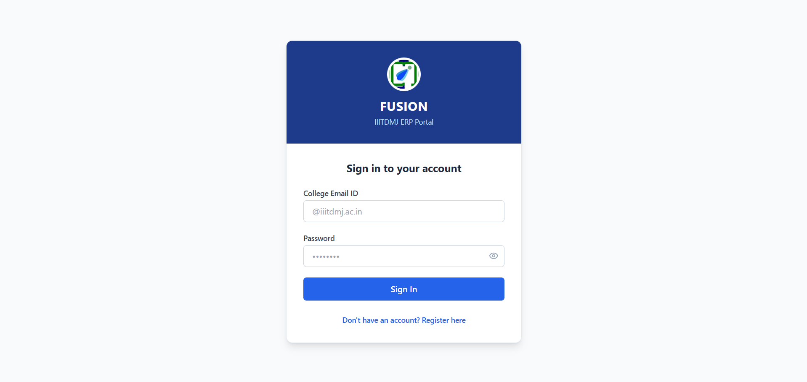
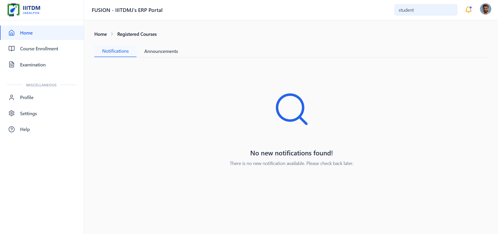
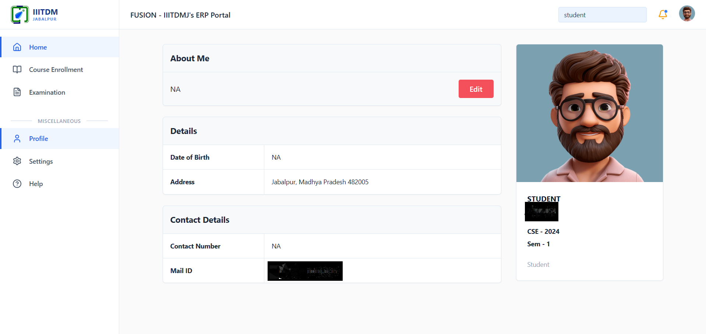
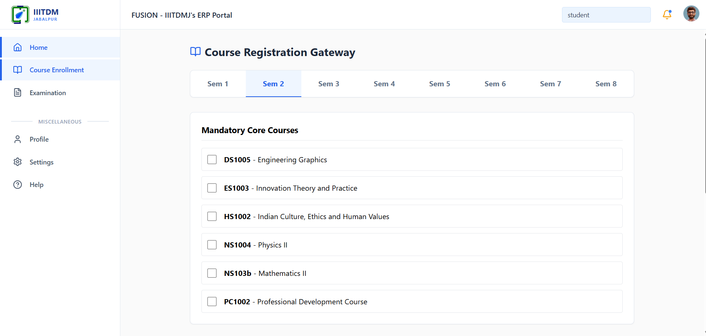
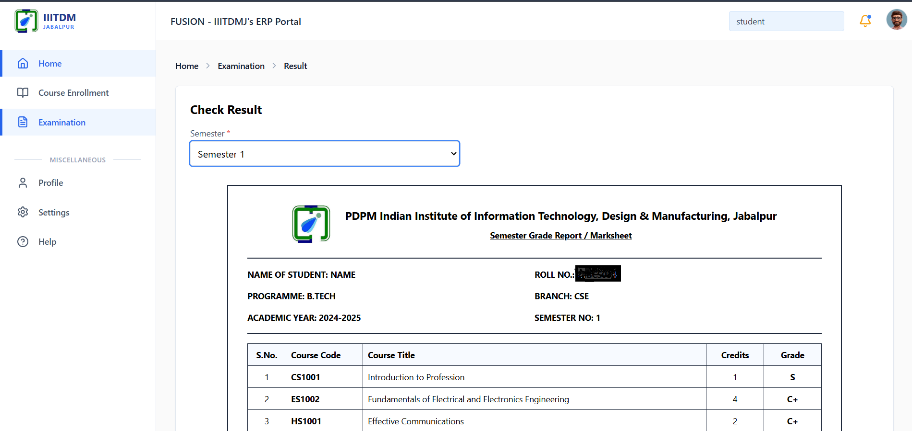

# 🎓 Student Academic Portal

A full-stack **Student Academic Portal** web application inspired by the **Fusion Portal**. The application provides a modern interface for students to manage their academic information, including authentication, student profile management, course enrollment, academic records, and result tracking.

---


---

# ✨ Features

- 🔐 Firebase Authentication
- 👤 Student Profile Management
- 📚 Course Enrollment System
- 📊 Academic Records & Results
- 🗄️ MySQL Database Integration
- 🌐 RESTful API Backend
- ⚛️ Responsive React Frontend
- ☁️ Cloud Deployment

---

# 🛠️ Tech Stack

## Frontend

- React
- Vite
- React Router
- Tailwind CSS

## Backend

- Node.js
- Express.js
- MySQL

## Services

- Firebase Authentication
- Railway (Database Hosting)
- Render (Backend Hosting)
- Vercel (Frontend Hosting)

---

# 📂 Project Structure

```text
student_academic_portal/
│
├── frontend/
│   ├── public/                     # Static public assets
│   ├── src/
│   │   ├── assets/                 # Images, icons, and static files
│   │   ├── components/             # Reusable UI components
│   │   ├── pages/                  # Application pages
│   │   ├── App.jsx                 # Main React component and routing
│   │   └── main.jsx                # React entry point
│   │
│   ├── .env                        # Frontend environment variables
│   └── package.json                # Frontend dependencies
│
├── backend/
│   ├── src/
│   │   ├── controllers/            # Handles request and response logic
│   │   ├── db/                     # Database connection and configuration
│   │   ├── middleware/             # Authentication and custom middleware
│   │   ├── models/                 # Database models and queries
│   │   ├── routes/                 # API route definitions
│   │   ├── utils/                  # Helper and utility functions
│   │   ├── app.js                  # Express application configuration
│   │   └── server.js               # Backend entry point
│   │
│   ├── .env                        # Backend environment variables
│   ├── serviceAccountKey.json      # Firebase Admin SDK credentials
│   └── package.json                # Backend dependencies
│
├── screenshots/
│   ├── dashboard.png
│   ├── enrollment.png
│   ├── login.png
│   ├── profile.png
│   └── results.png
│
└── fusion_portal_clone.sql         # MySQL database schema
```

---

# 🚀 Installation

## 1. Clone the Repository

```bash
git clone https://github.com/ganeshkarthik016/student_academic_portal.git

cd student_academic_portal
```

---

## 2. Backend Setup

Navigate to the backend directory.

```bash
cd backend
npm install
```

Create a `.env` file inside the backend directory.

```env
DB_HOST=your_host
DB_USER=your_user
DB_PASSWORD=your_password
DB_NAME=your_database
DB_PORT=your_port

PORT=5000
```

Start the backend server.

```bash
npm start
```

---

## 3. Frontend Setup

Navigate to the frontend directory.

```bash
cd frontend
npm install
```

Create a `.env` file.

```env
VITE_API_URL=http://localhost:5000
```

Start the development server.

```bash
npm run dev
```

---

# 🌍 Deployment

| Service | Platform |
|----------|----------|
| Frontend | Vercel |
| Backend | Render |
| Database | Railway |
| Authentication | Firebase |

---

# 📸 Screenshots

## 🔐 Login Page



## 🏠 Dashboard



## 👤 Student Profile



## 📚 Course Enrollment



## 📊 Academic Results



---

# 📚 API Overview

## Authentication

- Firebase Authentication

## Student

- Get Student Profile
- Update Student Profile

## Courses

- View Available Courses
- Enroll in Courses

## Academic Records

- View Semester Results
- View Overall Academic Record

---

# 🔒 Environment Variables

## Backend

```env
DB_HOST=
DB_USER=
DB_PASSWORD=
DB_NAME=
DB_PORT=

PORT=5000
```

## Frontend

```env
VITE_API_URL=http://localhost:5000
```

---

# 💻 Built With

- React
- Vite
- Express.js
- Node.js
- MySQL
- Firebase Authentication
- Railway
- Render
- Vercel

---

# 📄 License

This project was developed for **educational and learning purposes only**.

---

# 👨‍💻 Author

**Ganesh Karthik**

If you found this project helpful, consider giving it a ⭐ on GitHub.